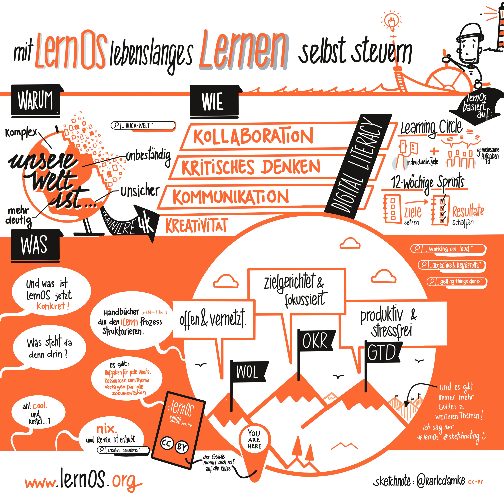
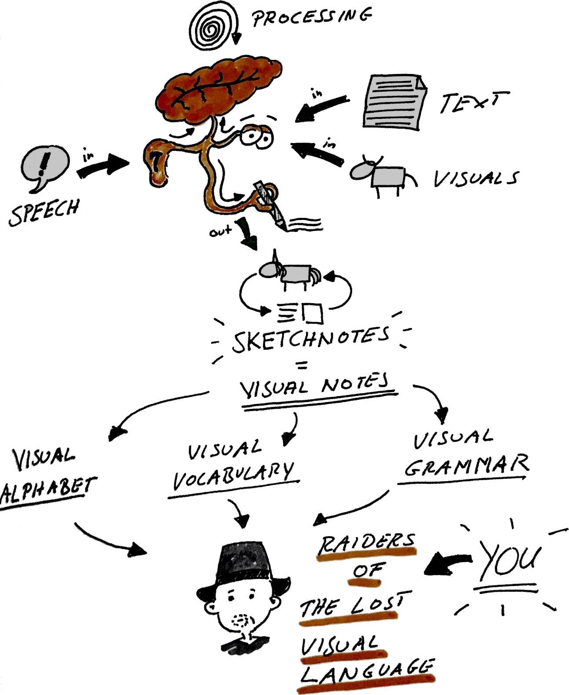
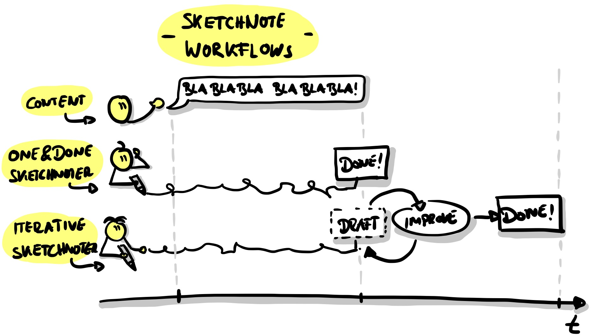

Einleitung

Um diesen Leitfaden bestmöglich nutzen zu können, solltest du etwas über lernOS wissen, auf dem dieser Leitfaden aufbaut. Dazu das Wichtigste in einer Sketchnote:

Wenn du mehr wissen willst, kannst alles über lernOS [bei Cogneon](https://cogneon.de/lernos/) nachlesen, dort den Leitfaden herunterladen oder dir [diesen Podcast](https://colearn.de/clp066-aufzeichnung-cl-sprint-12-4-2019-die-kunst-des-selbstgesteuerten-lebenslangen-lernens/) mit lernOS Mastermind Simon Dückert anhören. Im lernOS Sketchnote Leitfaden werden wir an einigen Stellen auf bestimmte Inhalte aus dem lernOS Leitfaden oder weiterführende Ressourcen verweisen. Mach dir aber keinen Stress und konzentriere dich auf die Inhalte und Methoden, die für dich unmittelbar wichtig sind - so hast du noch etwas übrig für die nächsten Sprints. ;)  

**Warum ein Sketchnote Lernpfad?**

In der aktuellen [VUCA](https://de.wikipedia.org/wiki/VUCA)-Welt können Sketchnotes ein supernützliches Werkzeug sein, dass dir hilft Informationen zu strukturieren und tief zu durchdringen. Sie können dir aber auch beim Lernen von neuen Dingen helfen oder dich und dein Team unterstützen, ein gemeinsames Bild zu bekommen

Wie bei allem gilt auch beim Sketchnoten: Übung macht den Meister! 

 Motivation, konstruktives Feedback und Zugang zu guten Ressourcen sind die Grundlage für Üben, das Spaß macht. Und nur wenn es Spaß macht, bleibst du dran... 

 
 ![lernos] de/src/sketchnotes/lernOS_sketchnoting_in_a_nutshell.png)

 Dafür haben wir den lernOS Sketchnote Lernpfad entwickelt. Er enthält: 

a) eine Einführung ins Sketchnoting & Wissen zu Material und Grundlagen (Kapitel 4) 

b) 23 Katas (Übungen) zu den wichtigsten Bereichen des Sketchnotens (Kapitel 5)

c) Ressourcen zum Weiterlernen, Vernetzen und Inspirieren lassen

Der Lernpfad funktioniert für alle “Level”, egal ob du erst seit 5 Minuten oder schon seit 5 Jahren sketchnotest. Wenn du ganz am Anfang stehst, wird dir sicherlich Kapitel 4 dabei helfen den Einstieg zu schaffen.

# Grundlagen

Keine Praxis ohne ein bisschen Theorie. Im folgenden Kapitel werden wir auf die Basics des Sketchnotens eingehen.

## Was sind Sketchnotes?

*"Sketchnotes sind visuelle Notizen, die aus einer Mischung aus Handschrift, Zeichnungen, handgezeichneter Typografie, Formen und grafischen Elementen wie Pfeilen, Kästen & Linien bestehen."* *- Mike Rohde, Autor des* [*Sketchnote Handbuchs*](http://rohdesign.com/) *und "Erfinder" des Begriffs Sketchnote*

*"Sketchnotes ist Rumkritzeln während du dir Notizen machst"* *- Kevin Thorn,* [*Nuggethead*](http://nuggethead.net/2013/01/what-are-sketch-notes/)

{#mid .center height=350}

Wer hat nicht als Kind auf sämtliche Oberflächen gemalt, gezeichnet und vor allem gekritzelt? Das Kritzeln (englisch: Doodling) ist ein super-einfacher Weg, Informationen zu verstehen und mit anderen zu teilen. Sunni Brown beschreibt das sehr eindrücklich in ihrem TED Talk "[Doodlers, unite!](https://www.ted.com/talks/sunni_brown?share=11cb8401a9&language=en#t-29444)". In ihrem Buch "The Doodle Revolution" zeigt Sunni, wie stark das Skizzieren von Informationen Innovation und kreatives Denken motiviert, indem sie kurz und bündig, sowie einfach verständlich auf den Punkt gebracht werden.

Historisch gesehen, sind wir Menschen visuelle Wesen. Bilder verwenden wir seit mehr als [20.000 Jahren](https://journal.lib.uoguelph.ca/index.php/perj/article/view/3137), die ältesten Höhlenmalerein sind sogar noch älter. Sie werden teilweise auf mehr als [35.000 Jahre datiert](https://de.wikipedia.org/wiki/H%C3%B6hlenmalerei).

Von einem wissenschaftlichen Standpunkt aus werden Sketchnotes durch die "[Dual Encoding Theorie](https://en.wikipedia.org/wiki/Dual-coding_theory)" gestützt. Diese beschreibt, dass Informationen die doppelt, also in unserem Fall als Text und Bild, kodiert und abgespeichert werden, stärker verankert werden. Sie lassen sich später schneller und genauer wieder erinnern, als "einfache" Textnotizen. Das Nutzen von Stift und Papier, oder auch digitalem Stylus und Tablet, hat also immense Vorteile gegenüber z. B. dem Mittippen am Laptop in einer Vorlesung oder einem Meeting. (s. Artikel von [Oppenheimer und Mueller](https://journals.sagepub.com/doi/10.1177/0956797614524581)) Das tiefe Verständnis von Konzepten und Ideen erschließt sich den Sketchnoter\*innen also viel schneller und einfacher als den "Mitschreiber\*innen", die Wort für Wort alles zu Papier bringen oder in das Notebook hackt.

Vielleicht liegt das daran, dass beim Rumkritzeln und Skizzieren ein Prozess im Gehirn abläuft, der konstruktiv ist. Wir müssen dafür die verschiedenen Elemente wie Legosteine zusammenbauen und dabei unser Wissen integrieren und organisieren, damit kein totales Chaos auf dem Papier entsteht. Wie Hazel Messenger in ihrem Artikel "[Drawing Out Ideas](https://web.a.ebscohost.com/abstract?direct=true&profile=ehost&scope=site&authtype=crawler&jrnl=18359442&AN=120666112&h=j66cPhqDECmzFTzdusRYarMmVfAAlKKDXnRef90BzvF9NuVMYq8%2fTh%2fERMpVyXIr8FJNnm8i0T0Vhw%2fkJW0hZQ%3d%3d&crl=f&resultNs=AdminWebAuth&resultLocal=ErrCrlNotAuth&crlhashurl=login.aspx%3fdirect%3dtrue%26profile%3dehost%26scope%3dsite%26authtype%3dcrawler%26jrnl%3d18359442%26AN%3d120666112)" weiter schreibt, wird durch die Verbindung von Spüren, Fühlen, Denken und Tun auch neues Wissen erzeugt, also aus all diesen Bauelementen konstruiert. 

Einfach auf den Punkt gebracht: Bilder, vor allem in Kombination mit Text, sind purem Text einfach überlegen. In der Literatur spricht man vom [Picture Superiority Effect](https://psycnet.apa.org/record/2011-13423-001). 

Wenn dir das alles zu komplex und textlastig ist, wir haben dir dazu eine Sketchnote erstellt: 

{#mid .center height=350}

## Was kann ich denn Sketchnoten?

Du kannst praktisch alles Sketchnoten. Hier nur ein paar Beispiele:

- Rezepte
- Prozesse
- Organisationen
- Geschichten
- Marketingpläne
- Geschäftsmodelle
- Uni-Vorlesungen
- Matheunterricht
- Predigten in der Kirche
- Beziehungslandkarten
- Theaterstücke
- Buchinhalte

Du kannst mit Sketchnotes also:

- Problemlösungen skizzieren
- Ideen finden
- Geschichten erzählen
- Reichtum anhäufen (vielleicht...)
- Spaß haben
- Zusammenarbeit verbessern
- Wissen mit anderen Menschen teilen!
- Partizipation und Verständnis schaffen
- Barrieren abbauen

## Was brauche ich zum Sketchnoting?

Das klingt ja alles ganz nett, aber was brauche ich denn, um mit dem Sketchnoten anfangen zu können? Ist das nicht alles total kompliziert? Zum Glück nicht! Das einzige, was du tatsächlich brauchst, sind ein Stift und eine Unterlage, auf der du Sketchnoten kannst, das kann ein Block, ein Notizbuch, eine Serviette sein oder der berühmte Bierdeckel. Natürlich kannst du auch digital auf deinem Tablet Sketchnoten.

### Sketchnotes mit Stift und Papier

Sketchnotes mit Stift und Papier sind die "ursprüngliche" Art der visuellen Notizen. Dieses "analoge" Vorgehen hat viele Vorteile. Einige sind sehr subjektiv, am besten du bildest dir deine eigene Meinung:

- Dein Papier hat keinen Akku, der genau dann leer ist, wenn du gerade Sketchnoten willst ...
- Stift und Papier schicken dir nicht ständig Notifications und lenken dich mit deinem Insta-Feed ab ...
- Wenn dein Notizbuch nass wirst, kannst du es trocknen und es wird danach vermutlich noch lesbar sein. Wirf mal dein Tablet in die Badewanne ...
- Auf Papier zu schreiben und zu zeichnen fühlt sich einfach "richtig" an ...
- Stift und Papier haben ein sehr intuitives Benutzer-Interface
- In einem digitalen Zeitalter bist du mit Stift und Papier fast schon ein Rebell ...
- Eine Sketchnote auf Papier kannst du jemanden in die Hand geben, du kannst sie anfassen und haptisch erleben. 
- Ein Blatt hat Grenzen - Mit der Zeit lernst du durch diese Begrenzung, dich auf das Wesentliche, die Kernaussagen, zu fokussieren!
- Stift und Papier sind die günstigste Art zu Sketchnoten!

Natürlich hat jede Medaille zwei Seiten. Ein paar Dinge können Stift und Papier tatsächlich nicht so gut:

- Um eine analoge Sketchnote online zu teilen, musst du sie erst einscannen oder abfotografieren (gute Dienste leisten hier übrigens die folgenden Apps [CamScanner](https://www.camscanner.com/), [Office Lens](https://www.microsoft.com/de-de/p/office-lens/9wzdncrfj3t8?activetab=pivot:overviewtab) oder [Adobe Scan](https://acrobat.adobe.com/de/de/mobile/scanner-app.html).
- Copy and Paste bzw. Cut and Paste sind mit Papier zwar grundsätzlich möglich, aber sehr sehr aufwändig!
- Korrekturen sind nicht so einfach bzw. “stören” das Gesamtbild
- Elemente vergrößern und verkleinern ist auch nicht so wirklich drin ...
- Ein Blatt hat Grenzen - "Voll ist voll", beliebig erweitern kannst du analoge Sketchnotes nicht. (Außer mit ausreichend Klebeband...) 

Auch wenn dir viele Webseiten etwas anderes erzählen, du brauchst weder spezielles Papier oder besonders teure Notizbücher, noch sind teure Stifte notwendig. Für den Anfang nimmst du einfach ein Blatt Papier aus dem Drucker und den erstbesten Stift, der auf deinem Schreibtisch liegt.

#### Papier- und Stift-Empfehlungen

Eine umfangreiche Liste findest du auf der Website von [Sketchnote Hangouts](https://sketchnotehangout.com/resources/). 

Wir haben uns hier gegen eine Auflistung von Marken und Produkten entschieden. Wir finden, Sketchnoten braucht keine teuren Stifte und besondere Notizbücher. Der einfachste Werbegeschenk-Kuli und ein die Rückseite eines mißlungen Ausdrucks sind perfekt. 

Ein "zu schönes" Sketchbook ist manchmal genau das, zu schön. Du traust dich nicht, anzufangen, aus Sorge, die Schönheit zu "ruinieren". Also: [KISS - Keep it simple, stupid!](https://de.wikipedia.org/wiki/KISS-Prinzip)

### Sketchnotes Digital

Mittlerweile kannst du auch super digital sketchnoten. Dafür empfiehlt sich in der Regel ein Tabletcomputer, die meisten Smartphones sind noch zu klein. (Ein Samsung Galaxy Note könnte aber schon reichen, wie es Opels Art [hier](https://www.youtube.com/watch?v=Lai-GBlRq9Y) zeigt...) Etwas komfortabler sind die meisten Tablets, wie z. B. das Apple iPad (Pro), das Samsung Galaxy Tab oder die Microsoft Surface Reihe.

Das digitale Sketchnoten bringt einige immense Vorteile mit sich:

- Du kannst (je nach App) super einfach Elemente verschieben, vergrößern und verkleinern, ausschneiden und kopieren.
- Das online Teilen ist quasi eingebaut...
- Deine Sketchnotes sind in einem Dateisystem abgelegt und vielleicht sogar durchsuchbar...
- Einige Apps bieten dir unbegrenzten Platz zum Sketchnoten (z.B. der "unlimited canvas" in der Concepts App), wenn dir noch wichtige Punkte einfallen, kannst du sie jederzeit anfügen.

Wie schon Stift und Papier, hat auch das Sketchnoten auf dem Tablet ein paar Nachteile:

- Mit einem leeren Akku guckst du echt in die Röhre.
- Lass das Tablet lieber nicht fallen, weder in die Badewanne noch auf den Fußboden!
- So ein Tablet mit einem Stylus (Stift) ist nicht wirklich günstig...
- Auf Glas schreiben und zeichnen fühlt sich, mindestens am Anfang, merkwürdig an. **#ProTipp:** Eine matte Displayschutzfolie erzeugt eine rauere Oberfläche. Viele DigiSketchnoter mögen dieses etwas papierähnlichere Schreibgefühl. 
- Du musst deine App sehr gut kennen, wenn du flüssig Sketchnoten möchtest. 
- Viele Optionen und Möglichkeiten können dich stark ablenken, genauso wie Benachrichtigungen über neue Mails, Twitter-DMs oder Insta-Likes...
- Unbegrenzter Platz zum Zeichnen kann auch überfordern und du willst jeden noch so kleinen Punkt noch mit in deine Sketchnote einbauen. Manchmal ist weniger einfach mehr...

Apps zum Sketchen: 

- [ProCreate](https://procreate.art/) - kostenpflichtig, für iOS (Doug Neill stellt [ProCreate als Sketchnote-Tool](https://www.youtube.com/watch?v=jhd8WQ9cBww) in einem Video vor)
- [Paper by WeTransfer](https://paper.bywetransfer.com/) (früher by 53) - Basisversion kostenlos, Abomodell, für iOS
- [Concepts](https://concepts.app/) - Basisversion kostenlos, für iOS, Android, Windows
- [Tayasui Sketches](https://tayasui.com/sketches/) - Basisversion kostenlos, für iOS, Android
- [GoodNotes 5](https://www.goodnotes.com/) - kostenpflichtig, für IOS 

Eine Übersicht über verschiedene Apps kannst du bei [Timo](https://sketchnoting.net/sketchnotes-apps/) und auf [Pixpa](https://www.pixpa.com/blog/drawing-apps) finden. 

## Sketchnote Elemente

Egal was das Thema ist, für deine Sketchnotes benutzt du immer wieder die gleichen Elemente. Wenn du diese grundlegend trainieren willst, oder mal wieder etwas Inspiration und Abwechslung brauchst, empfehlen wir dir “Sketch it - Das Kartenspiel” von Wibke Tiedmann und Stefanie Maurer, das du [hier herunterladen kannst](https://sketchnotegame.wordpress.com/download-kartenspiel/) und unter CC BY SA 4.0 verwenden darfst.  Alle folgenden Beispiele zu den Sketchnote Elementen stammen aus diesem Spiel.

*„*[*Sketch it – Das Kartenspiel*](https://sketchnotegame.wordpress.com/download-kartenspiel/)*„ von*[ *Wibke Tiedmann & Stefanie Maurer*](https://sketchnotegame.wordpress.com/ueber/)*, Lizenz:*[ *CC BY-SA 4.0*](https://creativecommons.org/licenses/by-sa/4.0/deed.de).

### Container

Ein Container strukturiert eine Sketchnote, indem er anderen Elementen einen Rahmen bietet.

{#small .left height=250 align=left}

### Trenner

Der Trenner sorgt dafür, dass die Elemente einer Sketchnote klar voneinander separiert sind und schafft so Ordnung und Klarheit.

{#small .right height=250 align=right}

### Text

Deine Sketchnote besteht aus Text und grafischen Elementen, wobei auch die Texte unterschiedlichste Formen und Farben annehmen können.

{#small .left height=250 float=left}

### Symbole und Icons

Symbole und Icons kannst du auf unterschiedliche Art und Weise beim Sketchnoten einsetzen. Du kannst dir z. B. ein eigenes Icon-Set anlegen, mit dem du wiederkehrende Elemente kennzeichnest. Ein Klassiker ist die aufleuchtende Glühbirne für eine Idee oder das Ausrufezeichen für etwas, das besonders wichtig ist.

{#small .right height=250 float=right}

### Verbinder und Pfeile

Verbinder und Pfeile sind starke Strukturelemente beim Sketchnoten. Sie erzeugen den Flow, dem das Auge des Betrachters folgt. Sie zeigen, welcher Teil auf welchen folgt, z. B. in einer zeitlichen oder logischen Abfolge. Verbinder und Pfeile halten deine Sketchnote zusammen. Sie sind das natürliche Gegenstück zum Trenner. 

{#small .left height=250 float=left}

### Figuren

Die Figuren sind die Akteur\*innen auf deinen Sketchnotes. Mit ihnen können Aktionen und Emotionen von einzelnen Personen aber auch von Teams oder Gruppen in verschiedenen Situationen dargestellt werden. Eventuell kann das Hinzufügen von Gesichtern oder Mimiken zum Darstellen von Emotionen hilfreich sein aber auch über die Körperhaltung drücken wir auch schon sehr viel unserer Gefühle und Regungen aus. Ob du den Figuren ein Gesicht gibst oder nicht hängt also fast gänzlich von deinem persönlichen Geschmack ab. 

{#small .left height=250 float=left}

### Diagramme

Mit Diagrammen kannst du super Daten in deiner Sketchnote visualisieren. Oft sind Programme wie Excel ein wenig "zu viel". Mit ein wenig Übung kannst du aus Elementen, wie Balken, Linien und Kreisen einfache, aber sehr wirkungsvolle Diagramme erschaffen. Ein sehr beeindruckendes Beispiel für analoge Datenvisualisierung ist das Projekt "[Dear Data](http://www.dear-data.com/theproject)" von Giorgia Lupi und Stefanie Posavec, die sich über ein Jahr gegenseitig Postkarten mit handgezeichneten Visualisierungen geschickt haben.

## Sketchnote Workflows

{#mid .center height=200}

### "One and Done" und iteratives Sketchnoten

Die "One and Done"-Sketchnoter\*innen erstellen ihre Sketchnotes zum Beispiel bei einem Talk auf einer Konferenz oder während eines Meetings. "One and Done" bedeutet, dass man mit der Sketchnote fertig ist, sobald das Ereignis beendet ist. Vielleicht wird am Schluss nochmal das ein oder andere kleine Detail korrigiert oder ergänzt, aber "One and Done" ist quasi "Live".

Beim iterativen Sketchnoten arbeitest du in mehreren, meist zwei, Stufen. Während des Events erstellst du eine grobe Entwurfsversion deiner Sketchnote, die anschließend nach dem Event überarbeitet und finalisiert wird. So kannst du detaillierter und genauer arbeiten als beim "One and Done" Ansatz, brauchst allerdings auch deutlich mehr Zeit, bis das endgültige Produkt fertig ist.

Einen noch tiefergehenden Prozess beschreibt Mauro Toselli, bekannt als [@xLontrax](https://twitter.com/xlontrax), in seinem Buch "[The xLontrax Theory of the Sketchnote](https://www.maurotoselli.com/the-xlontrax-theory-of-sketchnote.html)":

- Mauro sammelt das Material und erstellt die erste Sketchnote
- Anschließend lässt sie bis zur nächsten Session liegen und "reifen"
- Die Sketchnote wird dann genau untersucht,
- bevor alles Überflüssige entfernt wird

Mauro definiert dafür den "Eraser Critical Point", den er definiert als "Anzahl der Elemente, die du aus deiner Sketchnote entfernen musst, um ihre Bedeutung zu kompromittieren". So sorgt sein Ansatz dafür, dass eine Sketchnote exakt die richtige Anzahl an Elementen hat, um den gewünschten Inhalt vermitteln. Laut seiner Erfahrung erfolgt dieser komplexe Prozess bei geübten "One and Done"-Sketchnotern automatisiert während des Sketchnotens.

Welcher Workflow der richtige ist? Das hängt von vielen Dingen ab:

- Was bist du selber für ein Typ?
- Was passt zur aktuellen Situation?
- Wieviel Zeit hast du?
- Wie möchtest du deine Sketchnote hinterher verwenden?

Hier gibt es kein Richtig oder Falsch, Sketchnote wie du es brauchst! 

Mauro hat extra für diesen Lernpfad eine Zusammenfassung gesketchnotet: 

{#small .center height=480}
