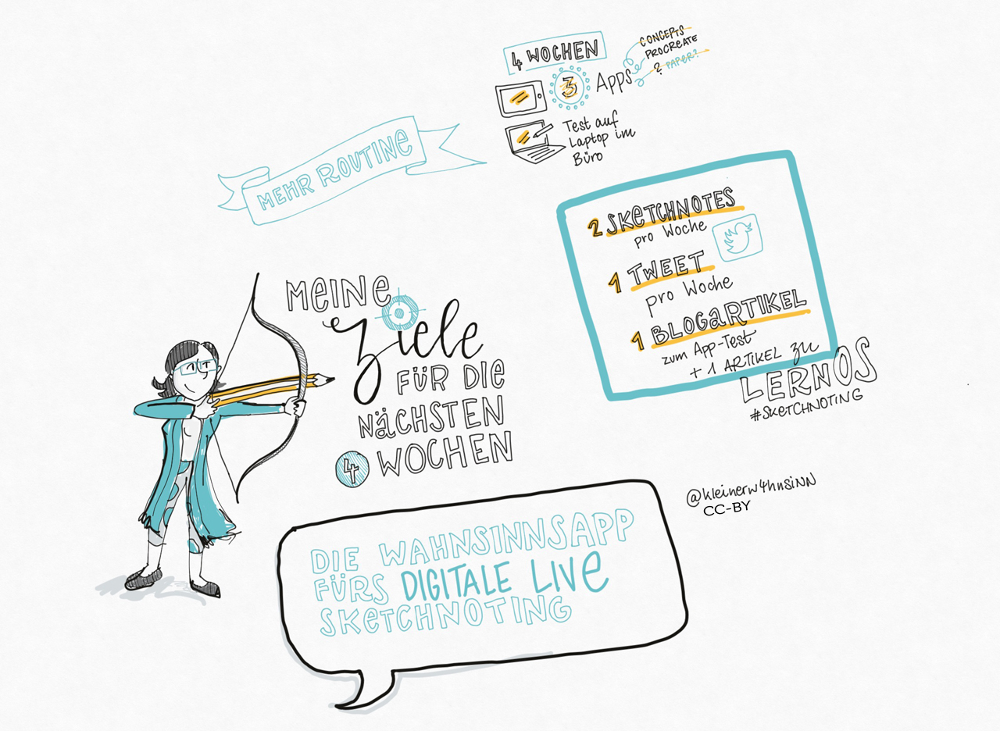

## Kata 4: Meine Ziele für die nächsten 4 Wochen

Verwendet in [Woche 1](0410_Woche_01.md)

Was willst du in den nächsten zwölf Wochen erreichen? Wähle ein Ziel, das dir wirklich, wirklich wichtig ist und bei dem du im Sprint Fortschritte machen kannst. Besonders für Sketchnote-Einsteiger\*innen ist es nicht oberste Priorität, das Ziel zu erreichen. Im Fokus steht neben dem Erlernen des Basiswissens, wie zum Beispiel das Aneignen eines eigenen visuellen ABCs, natürlich ganz besonders das regelmäßige Üben der neu gewonnenen Fähigkeiten und zu guter Letzt die Hauptsache:  ganz viel Spaß :-)

Um einen optimalen Lernerfolg zu bekommen, ist es dennoch sehr  wichtig, dir selbst Ziele zu setzen, die dich motivieren und mit denen du deine Fortschritte greifbar und sichtbar machen kannst. Du wirst deine Ziele nach der SMART-Formel setzen oder die OKR-Methode von Google verwenden, um dein Ziel zu definieren. Überlege, ob du vielleicht auf ein konkretes Produkt hinarbeiten möchtest. Das könnte zum Beispiel ein Sketchnote Workshop für deine Kolleg*innen sein, oder dein erstes Graphic Recording, oder, oder, oder...

Überlegt euch, wie ihr euren Fortschritt im Circle teilen wollt. Allein im Check-In ist ein bisschen wenig. Gibt es in eurem Dokumentations-Tool eine Möglichkeit dafür, euren Fortschritt zu protokollieren?

**Ziele definieren mit der SMART-Formel:**

{#mid .center height=200}

Ein guter Weg ein Ziel zu definieren, ist der Einsatz der SMART-Methode. Dabei werden verschiedene Kriterien angewandt, an denen sich die Definition deines Zieles messen muss, um als smartes Ziel zu gelten.

**S**pezifisch: Ist wirklich klar ausgedrückt, was du machen möchtest, oder bist du vielleicht zu schwammig in deiner Formulierung? Was gehört dazu, und ganz besonders was nicht? Nur wenn du wirklich genau weißt, was du tun möchtest und wo aber auch die Grenzen deines Vorhabens liegen, kannst du dich auf den Weg machen und sicher sein, dass du auch dort ankommst wo du hin willst ohne dich zu verzetteln und irgendwo auf dem Weg völlig die Orientierung zu verlieren.

**M**essbar:  Was muss passiert sein damit du sagen kannst, dass dein Ziel erreicht ist. Welches Arbeitsergebnis muss vorliegen? Wenn du zum Beispiel "besser" in etwas werden möchtest, ist das nicht messbar, ohne dass du dieses "besser" klarer formulierst. Dazu musst du dir in diesem Fall Fragen stellen wie: Besser als was möchte ich denn werden? Woran mache ich dieses "besser" denn genau fest? Dabei kann dir der erste Punkt schon gute Dienste leisten, denn je spezifischer du bei der Definition deines Zieles bist, um so eher hast du die Chance ein Ergebnis zu bekommen, das du präzise bewerten kannst. 

**A**ttraktiv: Dein Ziel muss dich motivieren. Du musst es erreichen wollen, wenn du 12 Wochen die Kraft aufbringen möchtest es wahr werden zu lassen. Deshalb ist dieser Punkt besonders wichtig. Am besten sollte es ein Ziel sein, dass du persönlich für dich ausgesucht hast und mit dem du dich auch zu 100% identifizieren kann. Ein Ziel das Andere für mich setzen wird selten den gleichen Wunsch in mir auslösen, es zu erreichen, wie eines das meinem eigenen Herzen entsprungen ist. In manchen Ausführungen zur SMART-Formel steht das A auch für **A**nspruchsvoll. Will meinen, dass dein Ziel nicht zu einfach sein sollte. Ein bisschen anstrengen und herausfordern sollte man sich schon, denn wer zu weit von seinen persönlichen Grenzen entfernt bleibt, kann sich selten wirklich verbessern. Aber Vorsicht: sich zu überfordern bringt auch nichts und für die meisten von uns soll dieser Lernpfad ja vor allem eines bringen: sehr viel Spaß! Und der kann bei zu ambitionierten Zielen am Ende schnell auf der Strecke bleiben. 

**R**ealistisch: Wie in der Grafik symbolisch mit einer durchgestrichenen Rakete dargestellt, musst du bei der Definition deiner Ziele buchstäblich auf dem Boden der Tatsachen bleiben. Der Lernpfad geht 12 Wochen und deshalb solltest du auch ein Ziel wählen, dass in dieser Zeit wirklich zu erreichen ist. Bist du eine der Personen, die ihre Ziele gerne etwas anspruchsvoller wählen? Dann solltest du dich noch mal genau hinterfragen, ob das, was du dir vorgenommen hast, auch wirklich machbar ist. Wie viel Zeit steht dir denn wirklich in der Woche zur Verfügung? Passt das Ganze wirklich hinein in den Rahmen der 12 Wochen des Lern-Sprints? Und wenn es vielleicht sein muss, sich von der einen oder anderen Idee erst mal verabschieden zu müssen ist das doch auch nicht weiter schlimm, denn wer sagt denn, dass der aktuelle Lern-Sprint der letzte war? :-)

**T**erminiert: Eine weitere wichtige Anforderung an dein Ziel, ist die des Termins zur Fertigstellung. Im Rahmen des Lern-Sprints kann dieser Termin sicherlich sehr genau bestimmt werden. Und das ist auch wichtig. Denn nur so kannst du zu jedem Zeitpunkt prüfen, ob du dich hinsichtlich Arbeitsergebnissen, offenen Punkten und eventuellen Problemen und Hindernissen noch auf einem guten Weg befindest, oder ob du unter Umständen mehr Energie in deine Arbeiten am Projekt stecken musst oder vielleicht sogar dein Ziel ein wenig verkleinern musst, um es überhaupt noch erreichen zu können. In Woche 6 werden wir uns die Zwischenergebnisse ansehen. Ein guter Moment das eigene Ziel noch mal SMART zu betrachten und gegebenenfalls ein wenig neu zu justieren.

**Weitere Informationen:**

- Wikipedia Artikel [SMART Criteria](https://en.wikipedia.org/wiki/SMART_criteria) (englisch)
- MIT Sloan Artikel [With Goals, FAST Beats SMART](https://sloanreview.mit.edu/article/with-goals-fast-beats-smart) (englisch)
- Artikel [OKR – Googles Wunderwaffe für den Unternehmenserfolg oder: Raus aus der Komfortzone](https://t3n.de/news/okr-google-wunderwaffe-valley-ziele-530092/) (deutsch)
- Ted Talk [How We Can Make the World a Better Place by 2030](https://www.youtube.com/watch?v=o08ykAqLOxk) (englisch)
- Video How Google Sets Goals: [OKRs mit Google Ventures Partner Rick Klau](https://www.youtube.com/watch?v=mJB83EZtAjc) (englisch)
- Video [OKR-Agiles Zielmanagement für den Mittelstand](https://www.youtube.com/watch?v=_ugCKONbBNs) (deutsch)
- Video [OKR - Führen mit Objectives and Key Results (OKRs) - so funktioniert das Google Leadership System](https://www.youtube.com/watch?v=y-aIyqMZfnE&t=) (deutsch)
- Buch [Introduction To OKRs von Christina Wodtke](https://www.oreilly.com/business/free/files/introduction-to-okrs.pdf) (englisch)
- Buch [The Beginner’s Guide To OKR von Felipe Castro](https://felipecastro.com/resource/The-Beginners-Guide-to-OKR.pdf) (englisch)

**Lernziel: **

- Du unterstützt deinen Lernerfolg durch Messbar machen deiner Ziele.

- Du motivierst dich und die anderen Teilnehmer\*innen durch Greifbar machen der Ziele.

  {#mid .center height=400}

{#mid .center height=400}
