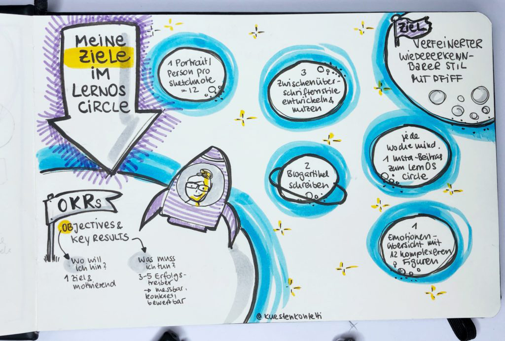

## Kata 4: Meine Ziele für die nächsten 4 Wochen

Was willst du in den nächsten zwölf Wochen erreichen? Wähle ein Ziel, das dir wirklich, wirklich wichtig ist und bei dem du im Sprint Fortschritte machen kannst. Du wirst die die OKR-Methode von Google verwenden, um dieses Ziel zu definieren. Besonders für Sketchnote-Einsteiger\*innen ist es nicht oberste Priorität, das Ziel zu erreichen. Im Fokus steht neben dem Erlernen des Basiswissens, wie zum Beispiel das Aneignen eines eigenen visuellen ABCs, natürlich ganz besonders das regelmäßige Üben der neu gewonnenen Fähigkeiten und zu guter Letzt die Hauptsache:  ganz viel Spaß :-)

Um einen optimalen Lernerfolg zu bekommen, ist es dennoch sehr  wichtig, dir selbst Ziele zu setzen, die dich motivieren und mit denen du deine Fortschritte greifbar und sichtbar machen kannst. Überlege, ob du vielleicht auf ein konkretes Produkt hinarbeiten möchtest. Das könnte zum Beispiel ein Sketchnote Workshop für deine Kolleg*innen sein, oder dein erstes Graphic Recording, oder, oder, oder...

Überlegt euch, wie ihr euren Fortschritt in euren OKRs im Circle teilen wollt. Allein im Check-In ist ein bisschen wenig. Gibt es in eurem Dokumentations-Tool eine Möglichkeit dafür, euren Fortschritt zu protokollieren?

**Weitere Informationen:**

- Wikipedia Artikel [SMART Criteria](https://en.wikipedia.org/wiki/SMART_criteria) (englisch)
- MIT Sloan Artikel [With Goals, FAST Beats SMART](https://sloanreview.mit.edu/article/with-goals-fast-beats-smart) (englisch)
- Artikel [OKR – Googles Wunderwaffe für den Unternehmenserfolg oder: Raus aus der Komfortzone](https://t3n.de/news/okr-google-wunderwaffe-valley-ziele-530092/) (deutsch)
- Ted Talk [How We Can Make the World a Better Place by 2030](https://www.youtube.com/watch?v=o08ykAqLOxk) (englisch)
- Video How Google Sets Goals: [OKRs mit Google Ventures Partner Rick Klau](https://www.youtube.com/watch?v=mJB83EZtAjc) (englisch)
- Video [OKR-Agiles Zielmanagement für den Mittelstand](https://www.youtube.com/watch?v=_ugCKONbBNs) (deutsch)
- Video [OKR - Führen mit Objectives and Key Results (OKRs) - so funktioniert das Google Leadership System](https://www.youtube.com/watch?v=y-aIyqMZfnE&t=) (deutsch)
- Buch [Introduction To OKRs von Christina Wodtke](https://www.oreilly.com/business/free/files/introduction-to-okrs.pdf) (englisch)
- Buch [The Beginner’s Guide To OKR von Felipe Castro](https://felipecastro.com/resource/The-Beginners-Guide-to-OKR.pdf) (englisch)

**Lernziel: **

- Du unterstützt deinen Lernerfolgs durch Messbar machen deiner Ziele.

- Du motivierst dich und die anderen Teilnehmer\*innen durch Greifbar machen der Ziele.

  {#mid .center height=400}

{#mid .center height=400}
>>>>>>> d9be7988958d86f279bc2f585cc55337790100ab
