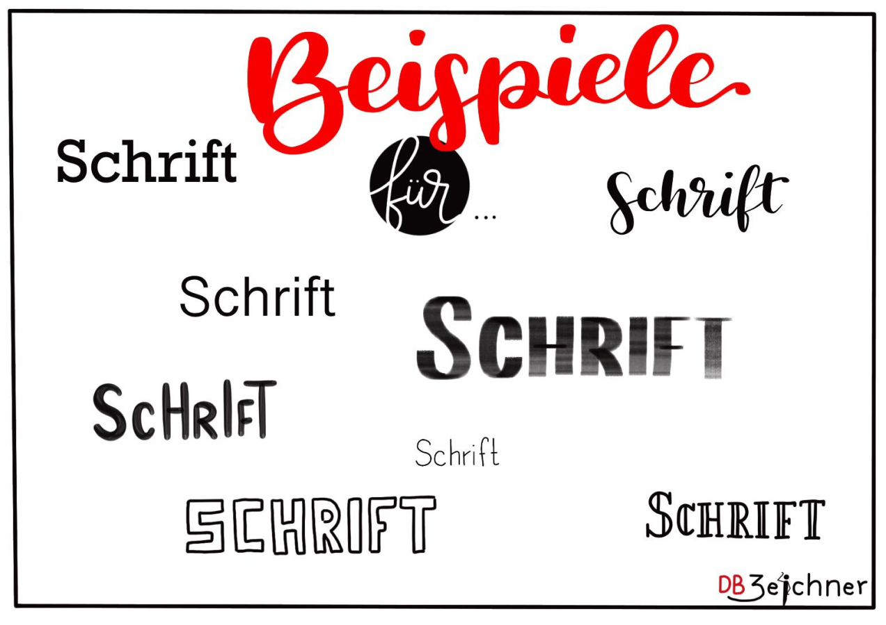
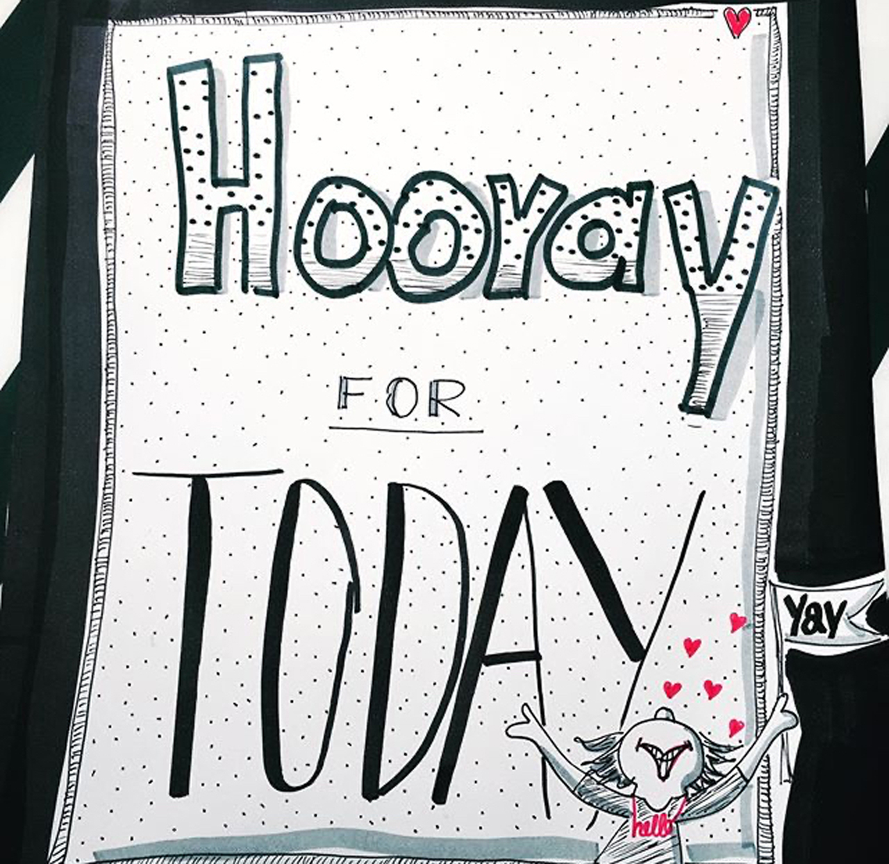
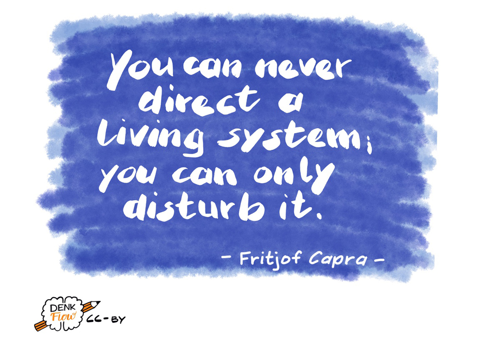
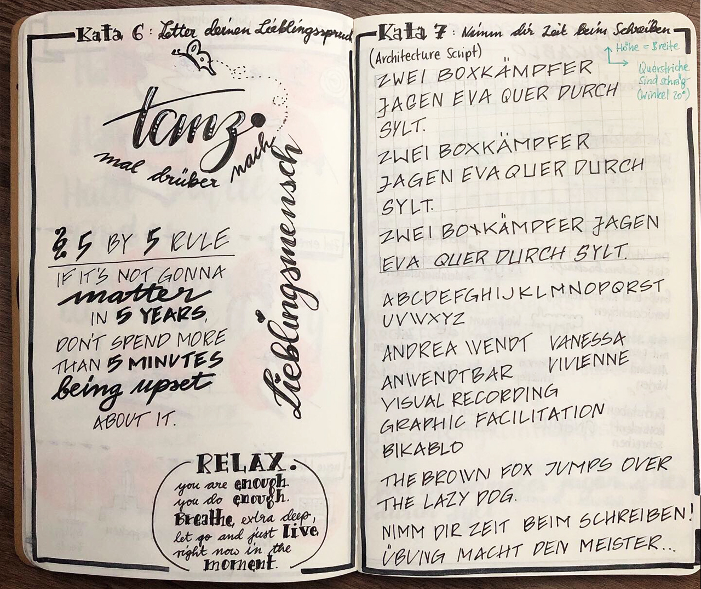

## Kata 6: Letter deinen Lieblingsspruch 

Eine Sketchnote lässt sich sehr gut mit verschiedenen Schriftarten und -größen gestalten und gliedern. Doch oft fallen wir beim Sketchnoten wieder zurück in unseren Gewohnheiten und nutzen immer nur dieselben, alten Lettern.

Nimm dir für diese Kata ein DIN-A5-Blatt und einen nicht zu langen Spruch deiner Wahl. Überlege dir, welche Wörter du in welcher Schrift und in welcher Größe schreiben möchtest. Was ist besonders wichtig, wo schwingt welche Emotion mit? Vielleicht machst du auch erst einmal eine kleine Bleistiftskizze für die Größenverhältnisse und zeichnest dann in sauber nach. Wenn du Inspiration für Schriften brauchst, schau dir doch die entsprechenden Karten im Sketchnote Game an. 

**Weitere Informationen:** 

- Video: [How to Write Neatly + Improve Your Handwriting](https://www.youtube.com/watch?v=_QA_NScPlt8)
- Video: [How to Improve your Handwriting | For Note-Taking and Journaling](https://www.youtube.com/watch?v=1YXjAu9o11o)
- Video: [5 tips on how I improved my handwriting](https://www.youtube.com/watch?v=aK2SLQx6j9Q)

{#mid .center height=300}

**Lernziel:**

- Du erkennst, welche Schriftarten in deinem eigenen Repertoire vorhanden sind.
- Du ergänzt dein Repertoires durch weitere neue Schriftarten.
- Du erkennst Schriftart als Stilmittel und setzt sie dementsprechend ein.

{#mid .center height=300}

{#mid .center height=300}

{#mid .center height=300}

{#mid .center height=300}